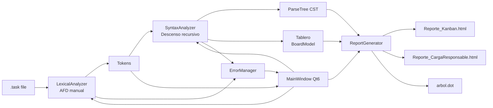
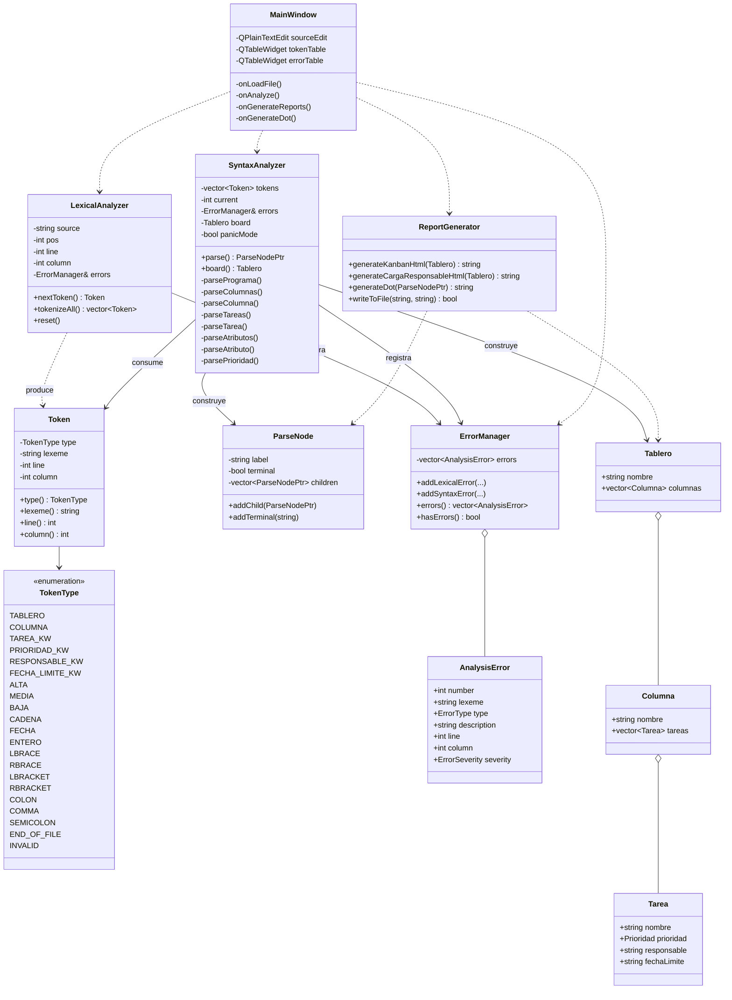
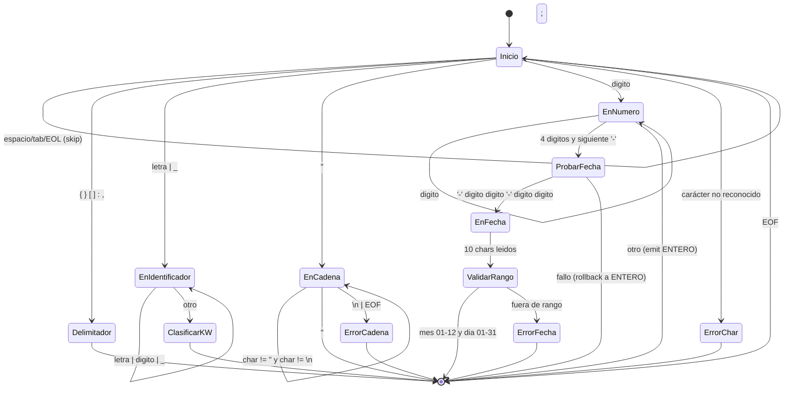

# Manual Técnico — TaskScript

Universidad de San Carlos de Guatemala
Facultad de Ingeniería · Escuela de Ciencias y Sistemas
Curso: **Lenguajes Formales y de Programación** · 1er semestre 2026
Carné: **202403125**

---

## 1. Objetivo

`TaskScript` es una aplicación de escritorio en C++17 con interfaz gráfica
Qt 6 que analiza archivos `.task` que describen tableros Kanban. La
aplicación cubre las dos primeras fases del pipeline de compilación:

1. **Análisis léxico** mediante un AFD implementado manualmente en
   `LexicalAnalyzer::nextToken()`. **No se utiliza `std::regex`** en ninguna
   parte del reconocimiento de tokens.
2. **Análisis sintáctico** mediante un parser descendente recursivo manual
   con una función por producción de la GLC. **No se utiliza ANTLR/Bison/
   Yacc/Flex.**

Adicionalmente la aplicación construye el árbol de derivación, lo exporta a
Graphviz (`arbol.dot`) y genera **2 reportes HTML** con CSS embebido
correspondientes a la sección 3.5 del enunciado:

- Reporte 1 — Tablero Kanban Visual.
- Reporte 2 — Carga por Responsable.

## 2. Arquitectura del sistema

### 2.1 Diagrama de componentes



### 2.2 Diagrama de clases



## 3. Especificación léxica

### 3.1 Alfabeto

- Letras `[A-Za-z_]`.
- Dígitos `[0-9]`.
- Delimitadores: `{`, `}`, `[`, `]`, `:`, `,`, `;`, `"`.
- Espacios en blanco: ` `, `\t`, `\r`, `\n`.
- Símbolo `-` solo dentro de literales de fecha.
- Comentarios de línea opcionales `// ...` (extensión de calidad de vida; no
  altera la gramática del enunciado).

### 3.2 Categorías de tokens

| Categoría | Patrón informal | Ejemplo | TokenType |
|-----------|-----------------|---------|-----------|
| Palabra reservada raíz | `TABLERO` | `TABLERO` | `TABLERO` |
| Palabra reservada sección | `COLUMNA` | `COLUMNA` | `COLUMNA` |
| Palabra reservada elemento | `tarea` | `tarea` | `TAREA_KW` |
| Palabra reservada atributo | `prioridad`, `responsable`, `fecha_limite` | `prioridad` | `PRIORIDAD_KW`, `RESPONSABLE_KW`, `FECHA_LIMITE_KW` |
| Enumeración | `ALTA \| MEDIA \| BAJA` | `MEDIA` | `ALTA`, `MEDIA`, `BAJA` |
| Cadena | `"` cualquier carácter excepto `"` y `\n` `"` | `"Diseñar AFD"` | `CADENA` |
| Fecha | `dddd-dd-dd` con mes 01-12 y día 01-31 | `2026-05-01` | `FECHA` |
| Entero | `d+` | `123` | `ENTERO` |
| Delimitadores | `{ } [ ] : , ;` | `{` | `LBRACE`, ... |

### 3.3 Diagrama del AFD



### 3.4 Recuperación léxica

- Si `nextToken()` encuentra un carácter fuera del alfabeto, lo registra
  como `ERROR` léxico y avanza el cursor un carácter para continuar el
  análisis. Devuelve un token `INVALID` para que el parser pueda decidir
  si sincronizar.
- Si una cadena alcanza el fin de línea o de archivo sin encontrar la
  comilla de cierre, se reporta como **`CRITICO`** y se devuelve el
  contenido parcial como `CADENA`, lo que permite al parser intentar
  continuar.
- Una fecha mal formada (mes/día fuera de rango) genera un error
  léxico y el token resultante es `INVALID` (no `FECHA`); el parser falla
  el `expect(FECHA, ...)` y reporta el error sintáctico secundario.

## 4. Gramática libre de contexto

### 4.1 Producciones (notación BNF)

```
<programa>   ::= TABLERO CADENA "{" <columnas> "}" ";"
<columnas>   ::= <columna> <columnas>
              |  <columna>
<columna>    ::= COLUMNA CADENA "{" <tareas> "}" ";"
<tareas>     ::= <tarea> "," <tareas>
              |  <tarea>
              |  ε
<tarea>      ::= "tarea" ":" CADENA "[" <atributos> "]"
<atributos>  ::= <atributo> "," <atributos>
              |  <atributo>
<atributo>   ::= "prioridad"    ":" <prioridad>
              |  "responsable"  ":" CADENA
              |  "fecha_limite" ":" FECHA
<prioridad>  ::= ALTA | MEDIA | BAJA
```

### 4.2 Justificación de extensiones respecto a la gramática del enunciado

1. **Coma colgante en listas.** El ejemplo del PDF (sec. 3.3) coloca una
   coma antes del `}` o del `]` final. Para aceptar literalmente el ejemplo
   se permite una coma colgante opcional en `<tareas>` y en `<atributos>`.
   Esto no introduce ambigüedad: la coma final es indistinguible del cierre
   de un elemento previo más uno vacío que no se acepta, por lo que la
   gramática sigue siendo determinista.
2. **Lista vacía de tareas (`ε`).** Se acepta una columna sin tareas como
   caso borde para que el sistema no aborte cuando un usuario crea una
   columna recién definida. El parser construye el `ParseTree` con un
   `<tareas>` sin hijos. Esta decisión se toma para mejorar la
   *robustez* requerida en la rúbrica (`Casos borde`).

### 4.3 First / Follow (resumen)

| No-terminal | First | Follow |
|---|---|---|
| `<programa>` | `TABLERO` | `$` |
| `<columnas>` | `COLUMNA`, `ε` | `}` |
| `<columna>` | `COLUMNA` | `COLUMNA`, `}` |
| `<tareas>` | `tarea`, `ε` | `}` |
| `<tarea>` | `tarea` | `,`, `}` |
| `<atributos>` | `prioridad`, `responsable`, `fecha_limite` | `]` |
| `<atributo>` | `prioridad`, `responsable`, `fecha_limite` | `,`, `]` |
| `<prioridad>` | `ALTA`, `MEDIA`, `BAJA` | `,`, `]` |

La gramática es **LL(1)** y se implementa con descenso recursivo sin
back-tracking salvo en el AFD para discriminar `ENTERO` vs `FECHA`.

## 5. Diseño del parser descendente recursivo

### 5.1 Mapping producción → función

| Producción | Función |
|---|---|
| `<programa>` | `SyntaxAnalyzer::parsePrograma()` |
| `<columnas>` | `SyntaxAnalyzer::parseColumnas()` |
| `<columna>`  | `SyntaxAnalyzer::parseColumna()` |
| `<tareas>`   | `SyntaxAnalyzer::parseTareas(Columna&)` |
| `<tarea>`    | `SyntaxAnalyzer::parseTarea(Columna&)` |
| `<atributos>`| `SyntaxAnalyzer::parseAtributos(Tarea&)` |
| `<atributo>` | `SyntaxAnalyzer::parseAtributo(Tarea&)` |
| `<prioridad>`| `SyntaxAnalyzer::parsePrioridad(Tarea&)` |

Cada función crea un `ParseNode` no terminal, agrega hijos por cada terminal
o no terminal consumido y retorna el nodo. Al mismo tiempo va llenando el
modelo semántico (`Tablero/Columna/Tarea`) que más tarde consume el
`ReportGenerator`.

### 5.2 Estrategia de recuperación de errores (modo pánico)

1. Ante un token inesperado se llama a `reportError(...)`, que registra el
   error en `ErrorManager` y activa la bandera `panicMode_`.
2. Mientras `panicMode_` está activa, errores subsecuentes en cascada
   **no se reportan**, evitando ruido.
3. La función actual invoca `synchronize({...})` con un conjunto de tokens
   de re-entrada (típicamente `,`, `;`, `}`, `]`, o palabras
   estructurales como `tarea`, `COLUMNA`, `TABLERO`).
4. `synchronize` consume tokens hasta encontrar uno del conjunto o uno
   estructural; al encontrarlo, desactiva `panicMode_` y la regla puede
   continuar produciendo nodos parciales.
5. La consecuencia es que la lista de errores queda **ordenada** por
   posición y el análisis no se detiene tras el primer fallo, satisfaciendo
   la sección 3.6 del enunciado.

## 6. Reportes generados

### 6.1 Reporte 1 — Tablero Kanban Visual

- Archivo: `Reporte_Kanban.html`.
- Layout: encabezado oscuro + grid horizontal con `display: flex` y
  `overflow-x: auto` para múltiples columnas.
- Cada tarjeta muestra: nombre de la tarea, una *badge* coloreada
  (`ALTA: #E74C3C`, `MEDIA: #F1C40F`, `BAJA: #27AE60`), responsable y
  fecha límite. Las columnas vacías muestran un mensaje informativo.

### 6.2 Reporte 2 — Carga por Responsable

- Archivo: `Reporte_CargaResponsable.html`.
- Tabla con: nombre del responsable, total de tareas, desglose por
  prioridad y barra de progreso cuyo ancho corresponde al porcentaje del
  total del tablero.
- Las filas se ordenan por carga descendente.

### 6.3 Árbol de derivación (Graphviz)

- Archivo: `arbol.dot`.
- Generado por `ReportGenerator::generateDot(ParseNodePtr)`.
- Los nodos no terminales usan `fillcolor="#2E75B6"` con `fontcolor=white`,
  los terminales `fillcolor="#D6EAF8"` con `fontcolor=#1B2631`, según la
  guía visual del enunciado.
- Para convertir a imagen: `dot -Tpng arbol.dot -o arbol.png`.

## 7. Decisiones de diseño

1. **Separación core/GUI.** El núcleo (`taskscript_core`) no depende de Qt.
   Se compila como librería estática y puede usarse desde herramientas CLI
   o pruebas automatizadas sin necesidad del entorno gráfico.
2. **`std::shared_ptr` para `ParseNode`.** Permite construir el árbol con
   rutas múltiples sin preocuparse por *ownership* explícito durante el
   parseo y la generación de reportes.
3. **Bandera `panicMode_` única**. Se evita reportar cascadas de errores
   sintácticos derivados del mismo fallo, mejorando la legibilidad de la
   tabla de errores. La bandera se desactiva al primer `expect` exitoso o
   al sincronizar con un *stopAt*.
4. **Detección de fechas con rollback explícito.** El AFD intenta un patrón
   `dddd-dd-dd` solo cuando los primeros 4 dígitos van seguidos de `-`. Si
   la secuencia falla se restauran `pos`, `line` y `column`, y se emite un
   `ENTERO` con los 4 dígitos. Esto evita ambigüedades al consumir
   números aislados o números mal formateados sin caer en `std::regex`.
5. **Solo 2 reportes HTML.** El enunciado describe 2 reportes en detalle
   (sec. 3.5) y los desarrollamos completos. La sección 3.5 del PDF no
   describe un tercer reporte; respetamos la especificación dada.

## 8. Estructura del repositorio

```
Proyecto2/
├── src/
│   ├── core/                 Token, Lexer, Parser, ErrorManager, Reports
│   ├── gui/                  Aplicación Qt 6
│   └── CMakeLists.txt
├── docs/                     Manuales en Markdown (este archivo)
├── tests/                    10 archivos .task de prueba
├── examples/                 2 archivos .task completos
└── README.md
```

## 9. Compilación reproducible

```bash
cmake -S Proyecto2/src -B build -DCMAKE_BUILD_TYPE=Release
cmake --build build -j
./build/TaskScriptApp        # Linux
open build/TaskScriptApp.app # macOS
```

Requisitos: C++17, Qt 6, CMake ≥ 3.16.

## 10. Exportación a PDF

Los manuales están escritos en Markdown con diagramas Mermaid. Para
generar PDFs:

```bash
# Opción 1: pandoc (con motor LaTeX)
pandoc Proyecto2/docs/ManualTecnico.md -o ManualTecnico.pdf \
       --pdf-engine=xelatex --toc

# Opción 2: VS Code (extensión "Markdown PDF" o "Markdown All in One")
# Opción 3: vista previa del navegador → imprimir como PDF
```
